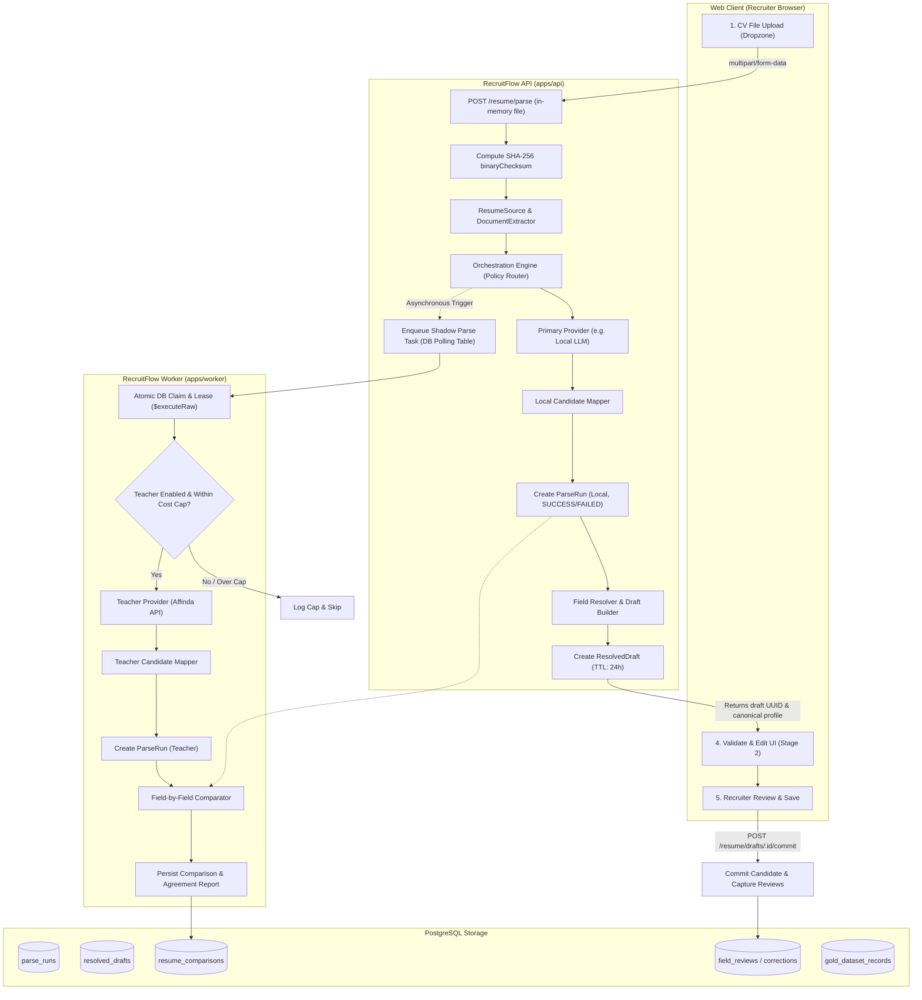

# Teacher–Student Resume Parsing Architecture Freeze

> **Status**: FROZEN & ARCHITECTURALLY COMMITTED  
> **Phase**: Phase 0 Complete — Awaiting Approval for Phase 1 Execution  
> **Target System**: RecruitFlow Ingestion & Matching Pipeline  
> **Scope**: Architecture specification, schema contracts, multi-tenant governance, lifecycle boundaries.

---

## 1. High-Level Architecture Diagram & Data Flow



### Decoupling Invariants
1. **Recruiter Latency Unaffected**: The recruiter flow (`POST /resume/parse`) only waits for the primary provider. The teacher (Affinda) NEVER runs synchronously in the HTTP request path.
2. **Failure Isolation**: An external teacher timeout, rate limit, or outage will never fail the recruiter's parse draft.
3. **Identity Without Persistence**: At parse time, `documentId` does not yet exist in PostgreSQL. Content identity is strictly anchored by SHA-256 `binaryChecksum`.

---

## 2. Shared vs. API-Only Boundary Specification

To guarantee browser safety and clean architectural layering, types and abstractions are strictly segregated:

| Responsibility Layer | Location | Allowed Dependencies | Prohibited Dependencies |
|---|---|---|---|
| **Shared Contracts** | `packages/contracts/src/resume/` | Pure TypeScript interfaces, Zod/domain schemas, string enums, pure helper functions (`unwrapFieldValue`, `isExtractedField`). | `Buffer`, `NodeJS.*`, `stream`, `fs`, `@nestjs/*`, `@prisma/client`. |
| **API Server Contracts** | `apps/api/src/resume/` | Node.js stream types, `Buffer`, NestJS decorators, HTTP interfaces, sealed blind review records. | Browser-only globals (`window`, `document`). |
| **Worker Processing** | `apps/worker/src/resume/` | PostgreSQL polling queries (`$executeRaw`), worker lease loops, background comparator runners. | Interactive HTTP contexts, client sessions. |

---

## 3. ResumeSource Contract & Lazy Document Extraction

The ingestion source avoids memory bloat by strictly separating lightweight metadata from lazy binary access.

### Shared Layer (`@recruitflow/contracts`)
- `SharedResumeSourceMetadata`: Contains `binaryChecksum` (SHA-256), optional `textChecksum`, `fileName`, `mimeType`, `fileSize`, `uploadedAt`, and optional `documentId?`.
- `NormalizedResumeDocument`: Contains structured text layout (`NormalizedResumePage[]`), total page count, extraction diagnostics, and checksums.

### API Layer (`apps/api/src/resume/source/`)
- `BinaryDocumentSource`: Interface offering lazy, non-permanent buffer loading:
  ```ts
  export interface BinaryDocumentSource {
    readonly byteLength: number;
    getBuffer(): Promise<Buffer>;
    openStream?(): NodeJS.ReadableStream;
  }
  ```
- `ResumeSource`: Encapsulates `SharedResumeSourceMetadata`, `BinaryDocumentSource`, and lazy `getNormalizedDocument(): Promise<NormalizedResumeDocument>`.

---

## 4. ProviderParseResult Discriminated Union

All parser executions yield a strict discriminated union preventing undefined outputs or missing error payloads:

```ts
export type ProviderParseResult<TRawData = unknown> =
  | ProviderParseSuccess<TRawData>
  | ProviderParseFailure;

export interface ProviderParseSuccess<TRawData = unknown> extends BaseProviderParseMetadata {
  readonly status: 'SUCCESS';
  readonly rawOutput: TRawData;
}

export interface ProviderParseFailure extends BaseProviderParseMetadata {
  readonly status: 'FAILED';
  readonly error: ProviderParseError;
}
```

---

## 5. Field Value Classification & Provenance Rules

Every extracted candidate property belongs to one of three explicit tiers:
1. **`ExtractedField<T>`**: Verbatim text discovered directly on the CV (e.g., `"Senior HRIS Specialist"`).
2. **`NormalizedField<T>`**: Standardized taxonomy term, O*NET code, or hospital catalog code (e.g., `"HR Software Engineering"`).
3. **`DerivedField<T>`**: Value synthesized via deterministic rules or formulas (e.g., experience months computed from work history timeline dates).

### Architectural Rules
- **Mandatory Provenance**: `provenance: FieldProvenance` is REQUIRED on `ExtractedField`, `NormalizedField`, and `DerivedField`.
- **Zero Duplicate Evidence**: `sourceSnippet`, `pageNumber`, `boundingBox`, and `textOffset` reside canonically inside `FieldProvenance`, eliminating divergent evidence fields on wrappers.

---

## 6. Canonical Resume Schema

The canonical schema (`CanonicalResumeParseResult`) represents RecruitFlow's single internal truth representation:
- **No `rawText`**: Prevents unredacted full CV leakage into parse runs and gold datasets.
- **No `evidenceChunks`**: Evidence chunk derivation is deferred to downstream semantic matching.
- **No root `fieldProvenance` map**: Provenance is colocated directly on each field.
- **Stable Item IDs**: Work history, education, and projects carry stable UUID identifiers (`workHistory[uuid-1].extractedTitle`).
- **Ungrounded Booleans Prohibited**: `isCurrent` is modeled as `ExtractedField<boolean> | DerivedField<boolean>` rather than an unverified bare boolean.

---

## 7. Non-Fabricated Provenance Model

RecruitFlow strictly prohibits fabricating pseudo-confidence scores (e.g. inventing `1.0` or arbitrary heuristic percentages):
- If an engine natively yields a probability, it is captured with `confidenceSource: 'provider'`.
- If RecruitFlow calculates a score, it is marked `confidenceSource: 'derived'`.
- If historical accuracy weights are applied, it is marked `confidenceSource: 'calibrated'`.
- If a recruiter confirms or edits the field, it is marked `confidenceSource: 'human'`.
- If no genuine score exists, `confidence` remains strictly `undefined`.

---

## 8. Multi-Provider Parsing Policy & Validation

`ParsingPolicyConfig` dictates runtime routing:
- `primaryProviderId`: Designates the interactive parser (e.g., local model).
- `registeredProviders`: Array of `ProviderRegistration` specifying provider roles (`teacher` | `student` | `fallback`).
- `teacherEnabled`: Master switch controlling external vendor calls.
- `teacherTriggers`: Set of triggers (`RANDOM_SAMPLE`, `ON_VALIDATION_FAILURE`, `ON_OBSERVABLE_UNCERTAINTY`, `ON_MISSING_CRITICAL_FIELDS`).
- `strictExtractionMode`: Enforces structured JSON output without tool execution.
- Cost and deduplication caps: `monthlyTeacherCostCapUsd`, `dailyCostCapUsd`, `deduplicateByChecksum`.

### Pure Policy Validator (`validateParsingPolicyConfig`)
Rejects impossible configurations:
1. Rejects missing or unregistered `primaryProviderId`.
2. Rejects duplicate `providerId`s in `registeredProviders`.
3. Rejects primary configured as a teacher when `teacherEnabled` is false.
4. Rejects more than one teacher provider registered.
5. Rejects `teacherEnabled: true` when no registered, enabled provider has role `teacher`.
6. Rejects non-empty `teacherTriggers` when `teacherEnabled` is false.
7. Rejects `teacherSamplingRate` outside `[0.0, 1.0]`.
8. Rejects `derivedConfidenceFloor` outside `[0.0, 1.0]`.
9. Rejects negative cost caps.

---

## 9. Observable Uncertainty Signals Model

Rather than relying on opaque confidence floats, uncertainty is determined from observable structural signals:
1. **Missing Identity Anchor**: Full name missing or unverifiable in header text.
2. **Missing Contact Anchor**: No valid email or phone number detected.
3. **Missing Role Anchor**: Current job title absent or ambiguous.
4. **Timeline Anomaly**: Total experience cannot be verified from work history dates.
5. **Schema Violation**: Required fields fail structural validation.

---

## 10. Per-Field-Type Comparison Semantics

The comparator evaluates primary vs. teacher outputs using type-specific semantics:
- **String Equivalence**: Normalized whitespace, case-insensitive, punctuation-stripped comparison.
- **Date Tolerance**: Evaluates date discrepancies using `deltaDays`; differences within configurable tolerance (e.g., ≤30 days / same month) are marked `MINOR_DIFFERENCE`.
- **Record Alignment**: Work history items are aligned using company name matching and date overlap; title synonyms are classified accordingly.
- **Set Fields**: Skills and certifications are evaluated using `SetMetricScores` (Precision, Recall, F1 score).

---

## 11. Multi-Metric Evaluation Framework

Evaluation against Human-Approved Ground Truth produces objective metrics:
- **Field-Level Accuracy**: Percentage of discrete scalar fields matching human truth.
- **Set Precision, Recall, F1**: Explicit set overlap metrics for skills, tools, and languages.
- **Inter-Rater Agreement Rate**: Consistency between local model and external teacher:  
  $$\text{Agreement Rate} = \frac{\text{Agree} + \text{MinorDifference}}{\text{Total Evaluated Fields}}$$  
  *(Explicitly tracked as consistency, not ground truth accuracy).*

---

## 12. Deterministic Field Resolver Contracts

When primary and shadow results are available, the Field Resolver arbitrates between them using deterministic, auditable rules:
- `DETERMINISTIC_PASS`: Both models agree; candidate value accepted automatically.
- `SOURCE_TEXT_VERIFIED`: Conflicting prediction verified against raw CV text.
- `HISTORICAL_PROVIDER_WEIGHT`: Field-specific historical accuracy priority applied.
- `CONFIDENCE_PRIORITY`: Genuine native confidence comparison.
- `PRIMARY_FALLBACK`: Fallback to primary extraction.
- `ESCALATE_TO_RECRUITER`: Critical discrepancy flagged for recruiter attention in Stage 2.

---

## 13. Server-Side ResolvedDraft Contract

- **Authoritative Entity**: `ResolvedDraft` lives server-side in PostgreSQL, keyed by a unique UUID.
- **Linked Lineage**: References `primaryParseRunId` and optional `shadowParseRunId`.
- **Configurable TTL**: Governed by `expiresAt` (default 24 hours). Abandoned drafts are cleaned up by worker sweepers.
- **Lifecycle Status**: `DRAFT` $\rightarrow$ `COMMITTED` | `EXPIRED` | `ABANDONED`.

---

## 14. Field-Level Review & Correction Tracking

Human recruiter actions in Stage 2 ("Validate & Edit") are captured immutably:
- **Stable Path Addressing**: `fieldId` strictly references stable item IDs, NEVER array indexes (e.g., `workHistory[uuid-1234].extractedTitle`).
- **Server-Authoritative Baseline**: `initialValue` is populated by the server from the draft, preventing client-side forgery.
- **Review Status**: `CONFIRMED`, `EDITED`, `REJECTED`, `UNREVIEWED`, `NOT_SHOWN`.
- **Full Lineage**: Corrections record the engine lineage (`providerId`, `modelVersion`, `promptVersion`) that produced the original prediction.

---

## 15. Complete ParseRun Lineage Tracking

`ParseRunRecord` captures full provenance for every parser execution:
- **Lineage Metadata**: `providerId`, `providerVersion`, `engineType`, `modelIdentifier`, `modelVersion`, `promptTemplateId`, `promptVersion`, `canonicalSchemaVersion`, `resolverVersion`.
- **Content Identity**: `binaryChecksum` (SHA-256) and optional `textChecksum`.
- **Discriminated Status**: `SUCCESS` (carries `canonicalResult` and `rawOutputPayload`) vs `FAILED` (carries `ProviderParseError`).
- **Multi-Tenant**: `organizationId` mandatory on every run.

---

## 16. Data Placement & Storage Separation

1. **In-Memory / Ephemeral**: Uploaded multipart files exist temporarily in RAM or `/tmp` and are discarded immediately after checksum calculation and text extraction.
2. **PostgreSQL (`apps/api`)**: Stores `ParseRun`, `ResolvedDraft`, `FieldReviewRecord`, and `ResumeComparisonReport`. Raw CV full text is NOT stored in these tables.
3. **Secure Document Store**: If the candidate is persisted, the document is archived in the secure document store with appropriate retention policies.

---

## 17. Gold Dataset Lifecycle & Privacy Preservation

Training data generation enforces strict privacy safeguards:
- **Zero Raw Canonical Profiles**: Direct PII is never stored unredacted in gold dataset records.
- **Paired Placeholders**: Uses synchronized paired placeholders (`[NAME_1]`, `[EMAIL_1]`, `[PHONE_1]`, `[ORG_1]`) between `redactedTrainingText` and `deidentifiedGroundTruth`.
- **Redaction Versioning**: Tracks `redactionMapVersion`.
- **Governance**: Records `legalBasis` (`CONSENT` | `LEGITIMATE_INTEREST` | `CONTRACT`), `consentGrantedForModelTraining`, `consentTimestamp` (mandatory when basis is `CONSENT`), and `allowCrossOrgTraining: false` (strictly enforced multi-tenant isolation).

---

## 18. Human Verification vs. Machine-Only Boundary

Within each gold dataset record, fields are strictly segregated:
- `humanVerifiedFields`: Array of field paths explicitly touched or confirmed by a recruiter.
- `machineOnlyFields`: Array of field paths accepted implicitly without human verification.
- **Rule**: Model training or fine-tuning pipelines must only train on `humanVerifiedFields`.

---

## 19. Blind Review & Quality Assessment Framework

Enables unbiased evaluation between competing providers:
- **Anonymization**: Evaluators view `optionA` and `optionB` without provider names or metadata.
- **Sealed Mapping**: Provider assignment (`optionAProviderId`, `optionBProviderId`) is stored strictly in `apps/api` (`SealedBlindReviewRecord`) and is NEVER exposed to the frontend browser.
- **Evaluation Submission**: Evaluators submit `BlindReviewSubmission` with preferences (`OPTION_A`, `OPTION_B`, `TIE`, `BOTH_INCORRECT`) and optional field-level assessments.

---

## 20. Project Folder Structure

```
recruitflow/
├── packages/contracts/src/resume/         # Pure, browser-safe shared contracts
│   ├── blind-review.schema.ts
│   ├── canonical-resume.schema.ts
│   ├── comparison.schema.ts
│   ├── field-provenance.schema.ts
│   ├── field-review.schema.ts
│   ├── field-values.schema.ts
│   ├── gold-dataset.schema.ts
│   ├── index.ts
│   ├── parse-run.schema.ts
│   ├── parser-provider.schema.ts
│   ├── parsing-policy.schema.ts
│   ├── resolved-draft.schema.ts
│   ├── resolver.schema.ts
│   └── resume-source.schema.ts
├── apps/api/src/resume/                   # Server-only implementations & accessors
│   ├── blind-review/
│   │   └── sealed-blind-review.interface.ts
│   ├── providers/
│   │   ├── canonical-provider-mapper.interface.ts
│   │   └── resume-parser-provider.interface.ts
│   └── source/
│       ├── binary-document-source.interface.ts
│       └── resume-source.interface.ts
├── apps/worker/src/resume/                # Asynchronous worker jobs
│   ├── processor.ts                       # DB polling claim loop ($executeRaw)
│   └── sweepers.ts                        # Draft TTL expiration cleaner
└── database/prisma/                       # Relational schema & additive migrations
    └── schema.prisma
```

---

## 21. Multi-Phase Implementation Roadmap

The project follows the approved 13-phase sequence. Progression requires satisfying all exit criteria for the preceding phase:

```
Phase 0: Architecture & Core Contracts (FREEZE)
   │
   ▼
Phase 1: ResumeSource & DocumentExtractor (Lazy Binary, Text Extraction)
   │
   ▼
Phase 2: Provider Abstraction & Mappers (Affinda + Legacy refactored into providers)
   │
   ▼
Phase 3: Local Provider (Local LLM structured extraction, prompt isolation)
   │
   ▼
Phase 4: ParseRun Persistence & ResolvedDraft (Additive DB tables, TTL cleanup)
   │
   ▼
Phase 5: Comparator & Shadow Execution (apps/worker DB polling claim, agreement metrics)
   │
   ▼
Phase 6: FieldResolver (Arbitration rules, human review escalation flags)
   │
   ▼
Phase 7: Review Capture (Stage 2 recruiter feedback, stable item ID addressing)
   │
   ▼
Phase 8: Evaluation & Blind Review (Sealed mapping, double-blind review UI)
   │
   ▼
Phase 9: Dynamic Routing & Orchestration (Policy-driven fallback, cost caps)
   │
   ▼
Phase 10: Gold Dataset Pipeline (PII redaction, paired tokens, consent tracking)
   │
   ▼
Phase 11: Benchmarking & Held-Out Validation (Frozen test set metrics)
   │
   ▼
Phase 12: Fine-Tuning Decision (Executed ONLY if evaluation justifies local adaptation)
```

---

## 22. Per-Phase Exit Criteria

| Phase | Core Deliverable | Objective Exit Criteria |
|---|---|---|
| **Phase 0** | Contracts Freeze | Zero Node types in `@recruitflow/contracts`; clean API build; all test suites pass; 100% compliance mapping. |
| **Phase 1** | `ResumeSource` & Extractor | Lazy binary loading verified without keeping Buffers in memory; text extraction unit tests pass for PDF/DOCX. |
| **Phase 2** | Provider Abstraction | Existing Affinda & regex parsers implement `ResumeParserProvider`; map outputs to canonical schema; no regression in existing tests. |
| **Phase 3** | Local Provider | Structured extraction produces valid `CanonicalResumeParseResult`; prompt injection delimited; zero tool call exposure. |
| **Phase 4** | Persistence & Drafts | Additive migration passes; `ParseRun` records lineage; `ResolvedDraft` serves Stage 2 with TTL expiration. |
| **Phase 5** | Shadow & Comparator | `apps/worker` polls and processes shadow runs asynchronously without blocking recruiter; comparison reports generated. |
| **Phase 6** | Field Resolver | Resolves conflicts deterministically; flags severe disagreements for recruiter attention. |
| **Phase 7** | Review Capture | Recruiter edits recorded with `fieldId` referencing stable item IDs; audit lineage intact. |
| **Phase 8** | Blind Review | Double-blind sample generation working; sealed provider mapping protected server-side. |
| **Phase 9** | Routing & Guardrails | Monthly and daily cost caps enforced; duplicate checksums bypass teacher billing. |
| **Phase 10** | Gold Dataset | PII redaction replaces sensitive entities with paired tokens; consent governance respected. |
| **Phase 11** | Benchmarking | Evaluation against frozen held-out test split executed; objective precision, recall, F1 reported. |
| **Phase 12** | Fine-Tuning Decision | Formal review of local model accuracy vs teacher; fine-tuning pursued only if cost/accuracy metrics warrant it. |

---

## 23. Audit Checklist & Verification Protocol

Before any code merge or phase transition:
1. `pnpm --filter @recruitflow/api build` must exit 0.
2. `pnpm --filter @recruitflow/web typecheck` must exit 0.
3. `grep \b(Buffer|NodeJS|ReadableStream|stream)\b packages/contracts/src` must yield 0 occurrences.
4. Existing regression tests (`matching-hris-regression.test.ts`, `resumeParser.test.ts`) must pass with 0 failures.
5. All database migrations must be purely additive (new tables, nullable foreign keys) and rollback-safe.

---

## 24. Architectural Risk Register & Mitigations

| Risk | Impact | Architecture Mitigation |
|---|---|---|
| **Accuracy Drift in Local Model** | Lower match quality | Continuous shadow benchmarking against teacher; inter-rater agreement tracking in Phase 5. |
| **Prompt Injection in Untrusted CVs** | System instruction bypass | Strict JSON schema mode; delimited untrusted text blocks; zero execution privileges or tool calling. |
| **Teacher Cost Overrun** | High vendor API bills | Monthly and daily cost caps; mandatory deduplication by SHA-256 `binaryChecksum`. |
| **Cross-Tenant Data Leakage** | Privacy violation | `organizationId` mandatory on all records; `allowCrossOrgTraining: false` strictly enforced by default. |
| **Unapproved PII Access** | Regulatory non-compliance | Reading parse runs, drafts, and reviews tied strictly to existing `VIEW_CANDIDATE_PII` permission. |
| **Downtime During Migration** | Service interruption | Additive schema migrations only; existing tables unmodified; nullable foreign keys. |

---

## 25. Phase 2 Parity Specification & Sole Intended Behavioral Difference

Under Phase 2 Provider Architecture (`ENABLE_PROVIDER_ARCHITECTURE=true`), the system maintains 100% deep equality with the legacy intake flow (`ENABLE_PROVIDER_ARCHITECTURE=false`), with exactly **one intended behavioral difference**:

- **Fallback Phone Enrichment**:
  When Affinda succeeds but lacks a phone number, and the normalized document text contains a detectable phone number, the fallback `LegacyParserProvider` (via `mergeCanonicalResults`) populates the phone number into the candidate record. Under the legacy flag-off flow, no fallback regex enrichment was performed when Affinda succeeded.
  Every other field (identity, title, email, experience, work history, education, skills, certifications, and SGH clinical enrichment) remains 100% identical between flag-on and flag-off.

---

## 26. Worker Thread Document Extraction Architecture & Isolation (Phase 1 Extension)

Document text extraction (`PdfDocumentExtractor` and `DocxDocumentExtractor`) can optionally run in isolated Node.js `worker_threads` governed by `ENABLE_WORKER_DOCUMENT_EXTRACTOR=true` (default: `false`):

### Problem & Vulnerability Mitigation
1. **Event Loop Latency Spikes**: Parsing pathological or complex PDFs in-process consumes 100% of the V8 main thread. Worker thread offloading reduces main event loop blocking to 0ms.
2. **Soft Timeout Gaps**: In-process extractors could hang within single pathological pages or unbounded XML decompression streams. The `ExtractionWorkerPool` implements hard thread termination (`worker.terminate()`) at `limits.timeoutMs` (default 15s).
3. **Memory Bomb / OOM Protection**: Malicious zip bombs or crafted font tables cannot crash the main NestJS API. Each worker runs in an isolated V8 isolate with `maxOldGenerationSizeMb: 256MB`. When a worker exceeds memory limits, it terminates without impacting the main API process, and the pool spawns a replacement worker.

### Error Code Mapping
- **Timeout or OOM**: Mapped to `DocumentExtractionError` code `'LIMIT_EXCEEDED'` (HTTP 503 retryable under dual-provider failure).
- **Corrupted PDF / Invalid ZIP / Bad DOCX XML**: Mapped to `'CORRUPTED_FILE'` (HTTP 400 `FILE_INVALID`).
- **Unsupported MIME / Extension**: Mapped to `'UNSUPPORTED_FORMAT'` (HTTP 400 `FILE_INVALID`).
- **Worker Execution Error**: Mapped to `'EXTRACTION_FAILED'` (HTTP 503 retryable).

### Configuration & Zero-Downtime Rollback
- `ENABLE_WORKER_DOCUMENT_EXTRACTOR`: Boolean (`false` by default). Instant rollback to in-process extraction by setting to `false`.
- `DOCUMENT_EXTRACTOR_WORKER_POOL_SIZE`: Integer pool size (default: `2`).
- `DOCUMENT_EXTRACTOR_WORKER_MAX_MEMORY_MB`: Integer memory ceiling per worker isolate (default: `256`).


